# PHOTO ALTER EGO｜真人 × 手绘分身

读取真人照片的发型、穿搭、配饰、动作与气质，设计一个对应本人的二维手绘分身，再把它放回原始摄影空间。

目标是“现实里的我，和画出来的另一个我一起出现在同一张照片里”。不复制固定卡通角色，也不把整张照片卡通化。

当前版本：**v1.1.1**。这是供 Codex 使用的 Skill，包含视觉规范、信息读取流程、构图控制、提示词模板和一个 Python 提示词编译器。图像生成由使用环境提供的编辑工具执行。

## 处理前后对比案例

以下6组为本Skill的实际处理结果，左侧为输入原图，右侧为选定成图。图片完整保留原文件，没有为展示重新生成、裁剪或加滤镜。

摄影模特原图来源：[SEAZ 官网](https://seaz.kr/)。二维手绘分身通过本Skill设计并使用图像编辑工具生成。

图库展示实际选定版本，部分案例经过修订。生成式编辑可能改变照片微细节；这些案例展示特征映射、动作变奏和空间落点，不是原图逐像素锁定的证明。

### 咖啡店街拍

黑色波波头、红T与条纹内搭、米色工装裤。分身在右侧路面，以插兜站姿呼应穿搭。

| 处理前：摄影原图 | 处理后：手绘分身 |
|---|---|
| 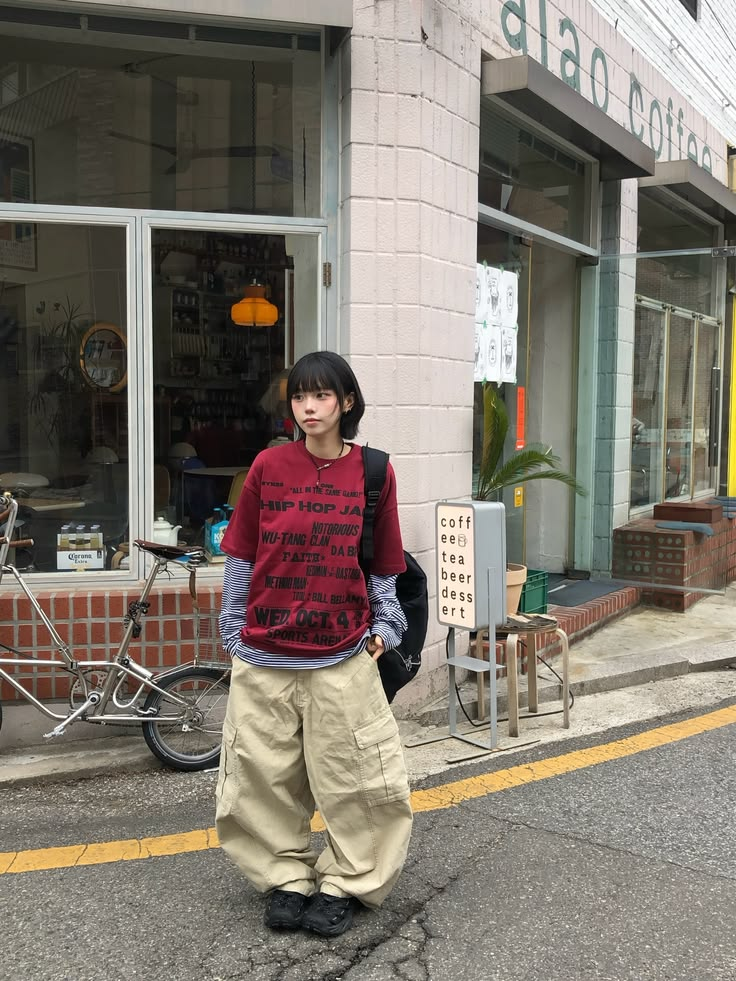 | 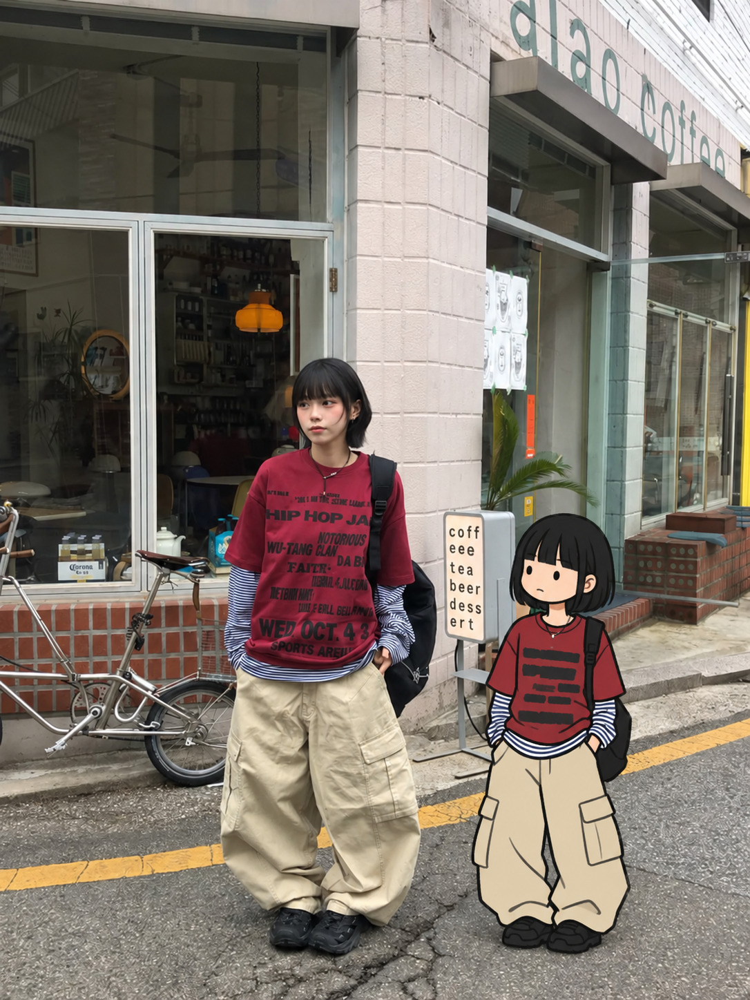 |

### 树下旅行照

酒红外套、白色胸前标志、深蓝宽裤。分身在左侧草地，一手扶肩带，形成同行者关系。

| 处理前：摄影原图 | 处理后：手绘分身 |
|---|---|
| 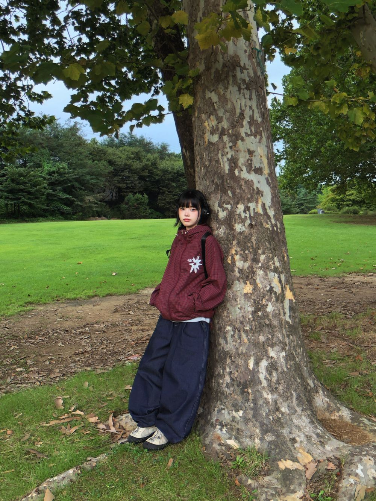 | 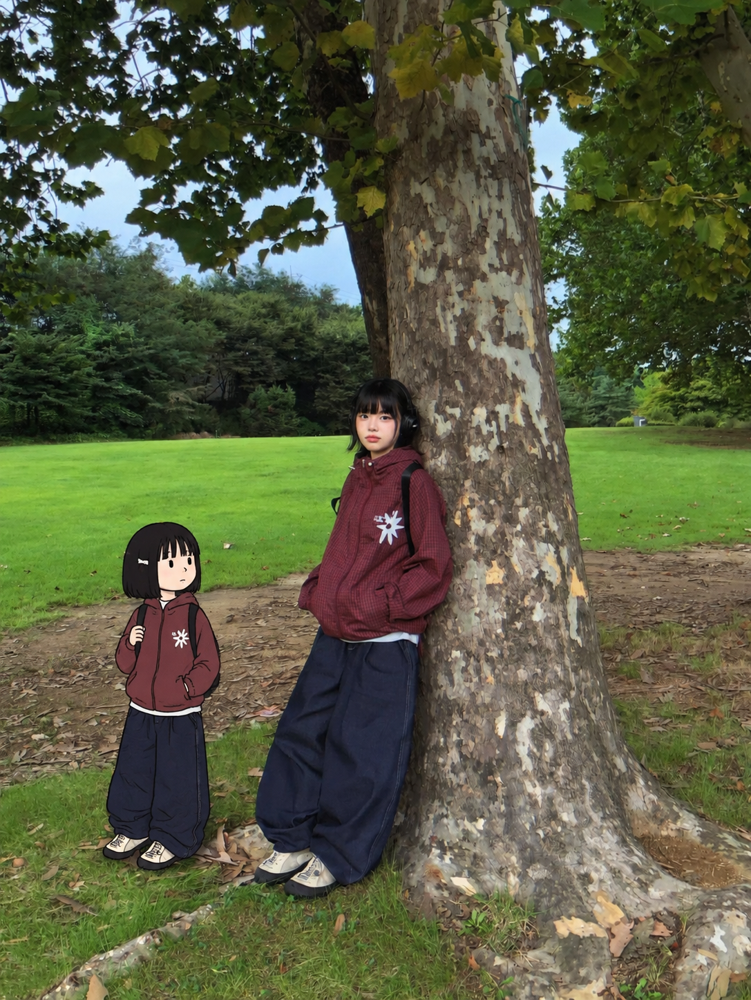 |

### 砖墙坐姿

黑短发、白色印字上衣、深色宽裤和星形项链。分身坐在左侧既有台阶上，抱包望向真人。

| 处理前：摄影原图 | 处理后：手绘分身 |
|---|---|
| 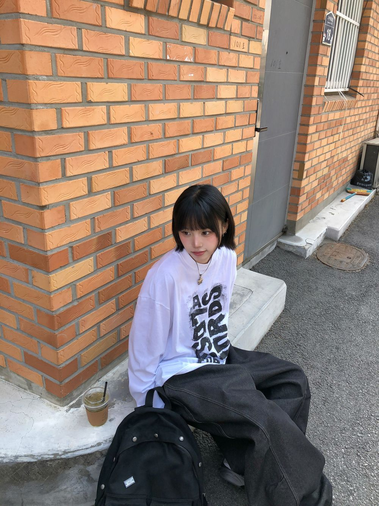 | 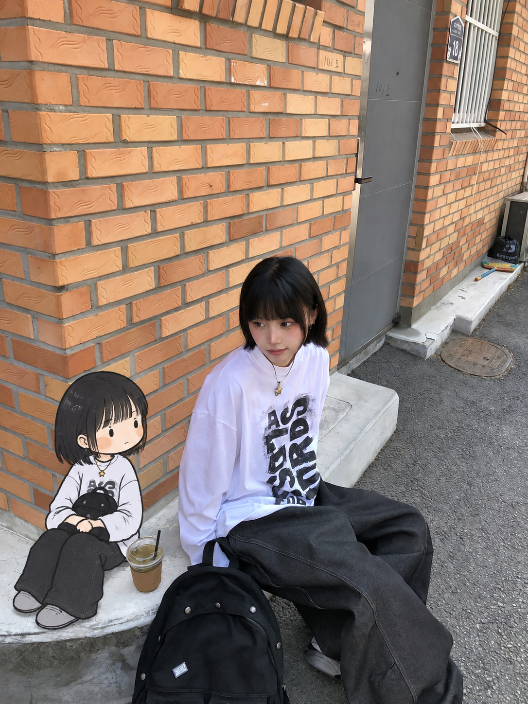 |

### 牧场举手

格纹衬衫、宽牛仔短裤、绿包与黄靴。分身在左侧近地面，呼应V手势和嘟嘴表情。

| 处理前：摄影原图 | 处理后：手绘分身 |
|---|---|
| 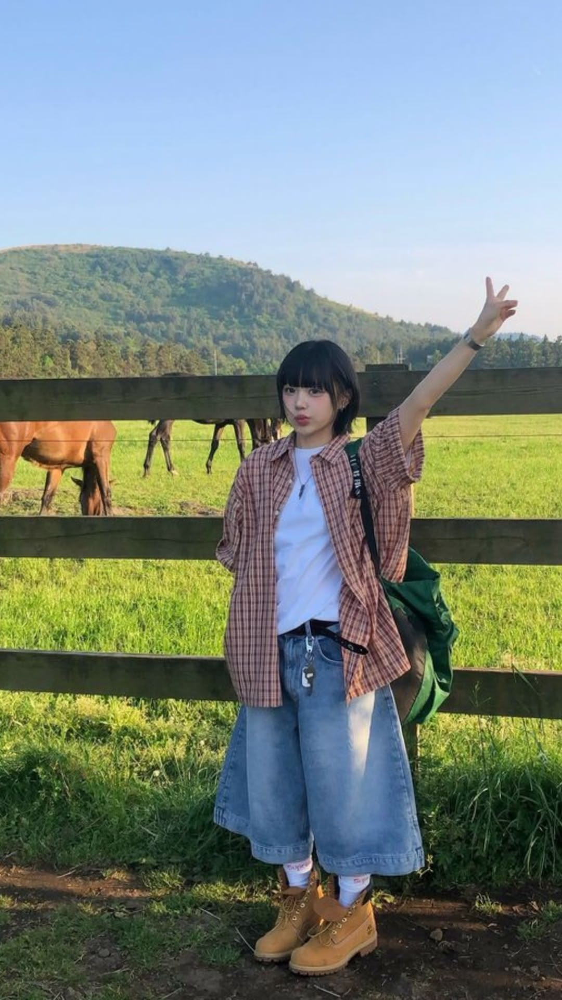 | 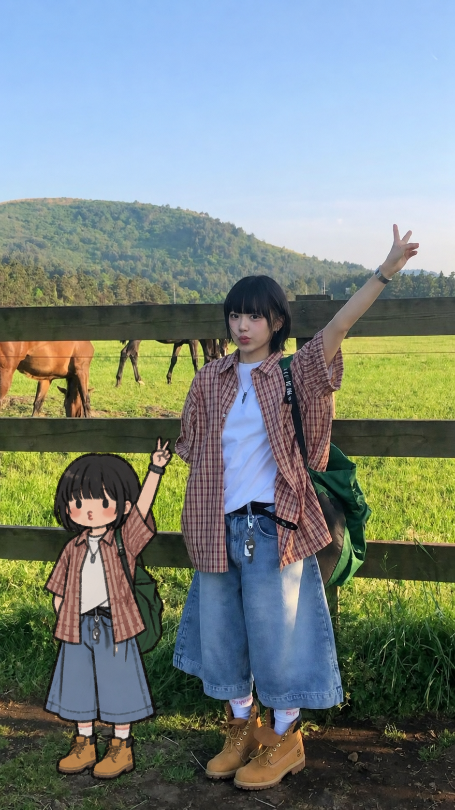 |

### 森林毛线帽

护耳毛球帽、长系带、深棕卫衣与灰宽裤。分身坐在左侧落叶地面，没有增添座椅。

| 处理前：摄影原图 | 处理后：手绘分身 |
|---|---|
| 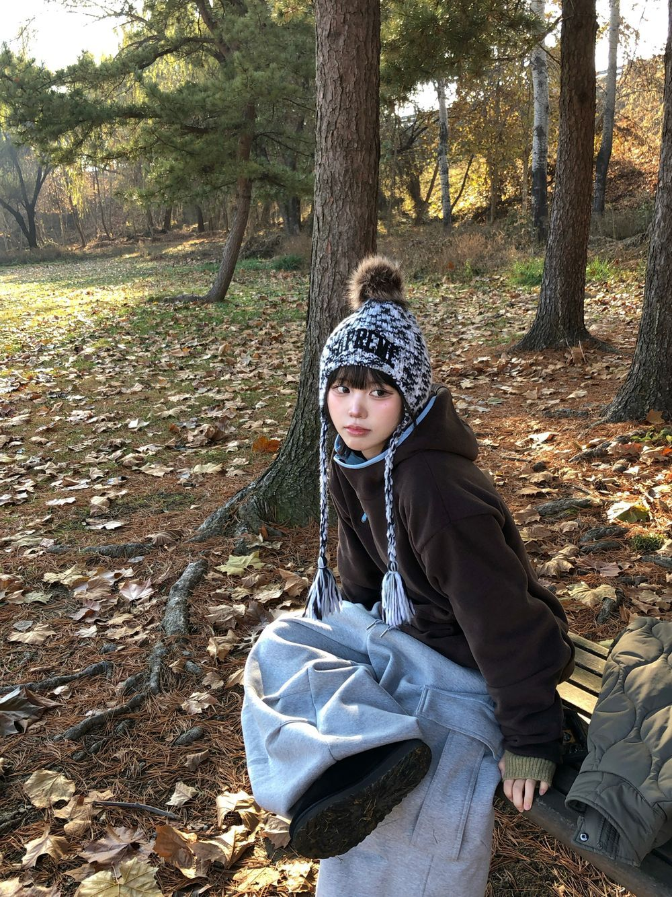 | 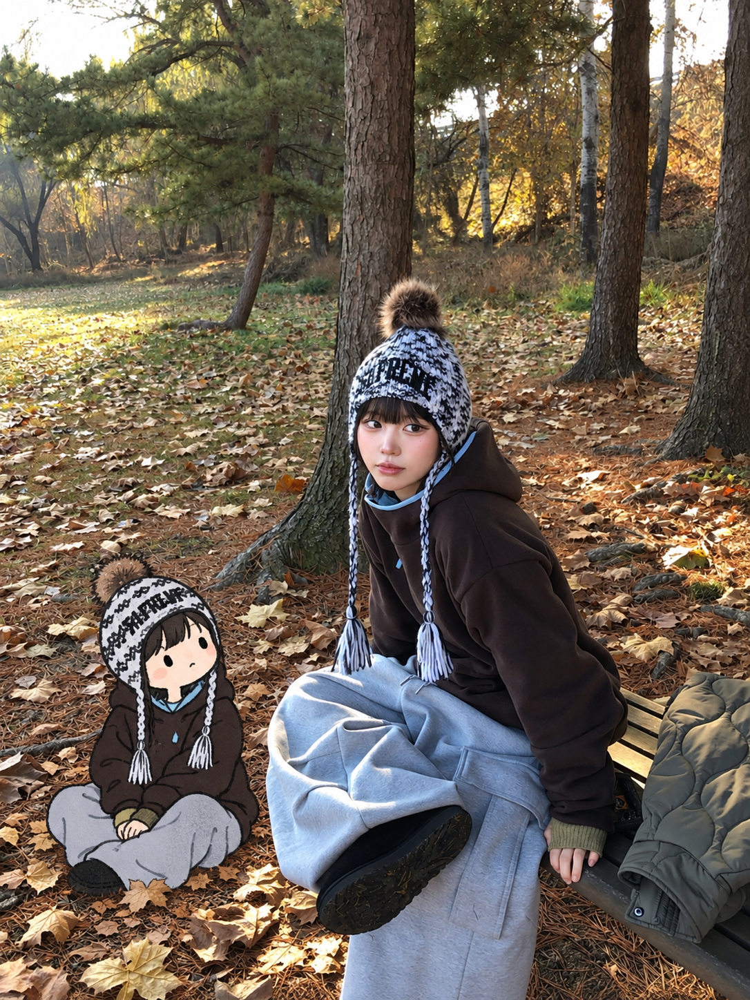 |

### 蓝帽街拍

海军蓝帽、浅金短发、白外套、紫领灰T与宽牛仔裤。分身在左侧路面双手插兜。

| 处理前：摄影原图 | 处理后：手绘分身 |
|---|---|
| 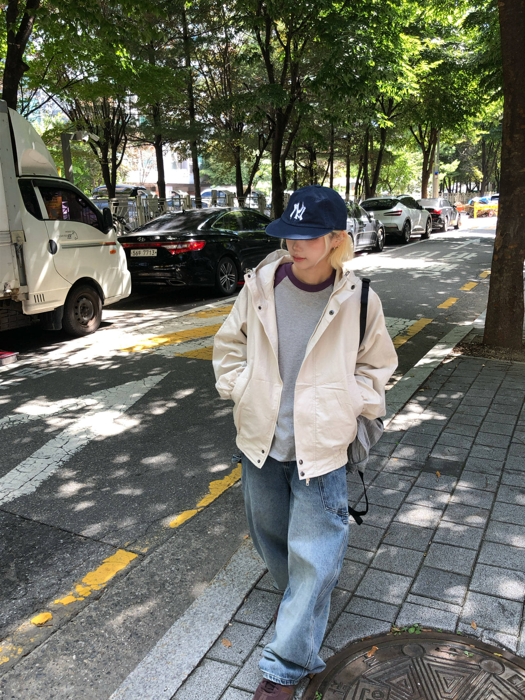 | 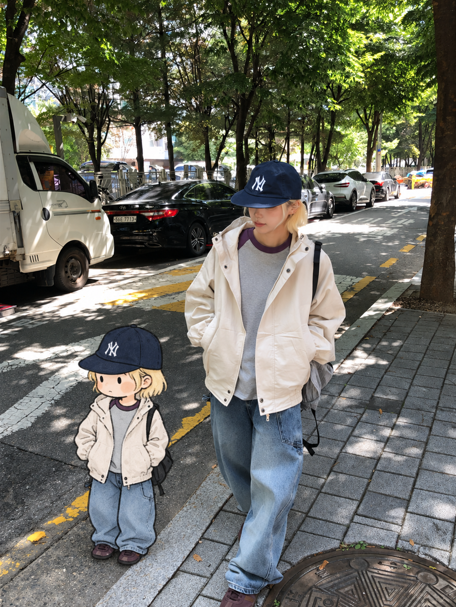 |

摄影原图及包含这些原图的案例图片不属于本仓库MIT许可范围，图片相关权利归各自权利人所有。来源标注不表示SEAZ参与、授权或背书本项目。

## 使用方式

安装后上传一张照片，并发送：

```text
使用 $photo-alter-ego，保留原照片，读取我的发型、穿搭、配饰与姿态，
设计一个与本人对应的二维手绘分身；根据空间选择动作和位置，不必逐关节模仿真人。
```

也可以只要求分析或生成提示词，此时 Skill 不启动改图。

支持街拍、旅行、生活、穿搭、室内与坐姿照片。多人同等突出时需要指定目标。看不见的服装与配饰记为未知，不随意补造。

## 可选分享署名提示

v1.1.1 在助手交付实际成图时，默认附一次：

> 若公开分享，欢迎标注：Visual Skill by [@Alexzzyk](https://github.com/Alexzzyk/photo-alter-ego)

提示只出现在最终回复文字中，不写进生成Prompt或图片像素；批量交付只显示一次。分析/只输出提示词、安装更新、未交付成图时不显示。用户要求纯图片、只给文件或不显示署名时不显示。

这是分享时的可选署名邀请，不是额外许可条件，也不要求用户确认或关注。实际是否展示取决于使用的助手读取和遵循Skill，无法强制所有客户端；已经安装旧版的人需要更新Skill才会读到新规则。

## 安装到 Codex

将完整仓库内容放到技能目录 `~/.codex/skills/photo-alter-ego/`，确保 `SKILL.md` 直接位于该目录。

新安装可运行以下命令；目标目录若已存在，先备份并人工比较，不直接覆盖：

```bash
git clone https://github.com/Alexzzyk/photo-alter-ego.git ~/.codex/skills/photo-alter-ego
```

安装后在 Codex 中刷新技能或开始新聊天，调用 `$photo-alter-ego`。实际改图需要图像编辑能力；仅编译提示词不需要网络或额外 Python 库。

## 工作机制

1. 读取照片中的人、头发、配饰、上衣、下装、鞋、包、手持物、姿态、表情、场景、支撑面和可用空间。
2. 将可识别特征分为必须保留、建议保留和可删除三层。服装压缩为大轮廓、主色与少量标志细节。
3. 分别选择动作与表情。动作可同步、互补或互动；不改变真人姿态来强行配合。
4. 先确定真实地面或座面，再以画面归一化坐标计算尺寸与安全区。
5. 用简短执行提示词实际编辑；保留完整提示词用于回查。
6. 对照原图，先检查真人和环境漂移，再看尺寸、支撑、身份映射及二维画法。明显错误最多两轮定向修订。

插画默认为紧凑的约3～4头身、深色手绘轮廓、简化五官、有限色板和平色服装。站姿通常从真人画面高度的60%～75%起步，依空间调整；坐姿按真实支撑和画面计算，不能机械套站姿比例。

## 提示词编译器

编译器只接收已经分析好的 JSON brief，进行字段校验、尺寸换算和模板编译；它不读取照片、不自动识别人、不调用模型。

在仓库目录运行：

```bash
python3 scripts/build_prompt.py references/example-street.json --out street-prompt.txt
python3 scripts/build_prompt.py references/example-indoor.json --format full --out indoor-full-prompt.txt
```

默认 `concise` 用于实际编辑；`--format full` 输出完整21区块，用于设计归档。输出文件已存在时拒绝覆盖。示例 JSON 对应假设场景，不是生成效果承诺。

## 文件结构

- [SKILL.md](SKILL.md)：技能入口、执行流程与验收边界。
- [完整视觉系统](references/visual-system.md)：角色设计、特征映射、空间规则、场景预设与最终系统提示词。
- [生成前控制](references/generation-control.md)：尺寸换算、绘制预算、修订范围和保真能力分流。
- [参考机制分析](references/reference-analysis.md)：12张参考作品的文字观察；参考图片不随仓库发布，运行不依赖这些图片。
- [concise模板](references/prompt-concise.txt)、[完整模板](references/prompt-template.txt)、[Negative Prompt](references/negative-prompt.txt)。
- [示例说明](references/examples.md)与两份示例 JSON。
- [scripts/build_prompt.py](scripts/build_prompt.py)：使用 Python 标准库的提示词编译器。
- [agents/openai.yaml](agents/openai.yaml)：Codex 界面元数据。

## 已验证与限制

v1.1.0增加尺寸预计算、简短执行模板、绘制预算与验收顺序。

**保留提示词不等于像素锁定。** 普通生成式编辑可能改变输出分辨率、清晰度、面部微细节或背景文字。必须对照原图复核，不能把保存成功或“看起来相同”宣称为原摄影像素完全不变。严格像素保真需求只能使用实际支持保护区域或图层合成的编辑能力。

## 贡献

欢迎通过 Issue 或 Pull Request 提交可复现的设计/编译问题。报告时优先提供去除私人信息的 brief、使用的模板类型、预期和实际行为；不要默认公开真人照片。

## 许可证

技能文档与代码采用 [MIT License](LICENSE)。案例图片的权利范围见 [图片来源与许可说明](assets/examples/SOURCES.md)。
